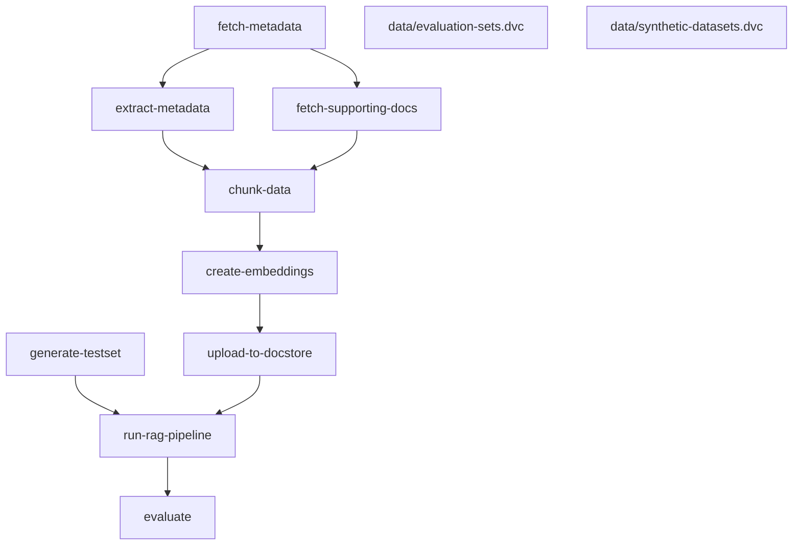

# llm-eval
This repository contains a reproducible workflow setup using [DVC](https://dvc.org/) backed by a [JASMIN object store](https://help.jasmin.ac.uk/docs/short-term-project-storage/using-the-jasmin-object-store/). Before working with the repository please contact [Matt Coole](mailto:matcoo@ceh.ac.uk) to request access to the Jasmin object store `llm-eval-o`. Then follow the instructions below.

## Requirements
- [Ollama](https://ollama.com/download) ([`llama3.1`](https://ollama.com/library/llama3.1) and [`mistral-nemo`](https://ollama.com/library/mistral-nemo) models)
- [Python 3.9+](https://www.python.org/downloads/)
- [uv](https://docs.astral.sh/uv/)

## Getting started
### Setup
This project uses `uv` to manage python version and dependency. If you haven't got `uv` installed, the easiest way to it is using `pip`:
```
pip install uv
```
This will allow you to use uv across projects. You can verify that the installation is successful by running:
```
uv --version
```

Once `uv` is installed you can use it to automatically download the appropriate version of python and create a virtual environment for running the project code. This can be done using:
```
uv sync
```
This will create a virtual environment in `.venv` and installed the necessary dependencies from `pyproject.toml`. Within the project, any commands that you wish to run can be preceeded by `uv run` to ensure that they run with the correct version of python and using the correct virtual environment.
> **Note:** The remainder of this readme assume you have either activated the virtual environment created using `source .venv/bin/activate` or that you are prepending all commands with `uv run`.

### Configuration
Next setup your local DVC configuration with your [Jasmin object store access key](https://help.jasmin.ac.uk/docs/short-term-project-storage/using-the-jasmin-object-store/#creating-an-access-key-and-secret):
```shell
dvc remote modify --local jasmin access_key_id '<ACCES_KEY_ID>'
dvc remote modify --local jasmin secret_access_key '<KEY_SECRET>'
```
### Getting the data
Pull the data from the object store using DVC:
```shell
dvc pull
```
### Working with the pipeline
You should now be ready to run the pipeline:
```shell
dvc repro
```
This should only reproduce the pipeline, but only stages that have been modified will actually be re-run (see output whilst running). If you want to check that all stages of the pipeline are running correctly you can either user the `-f` flag with the above command to force DVC to re-run all stages of the pipeline or (as re-running with all the data can take several hours) run the convenience script `test-pipeline.sh`. This script will run the pipeline with a tiny subset of data as an experiment which should only take a copule of minutes:
```shell
./test-pipeline.sh
```

This pipeline is defined in [`dvc.yaml`](dvc.yaml) and can be viewed with the command:
```shell
dvc dag
```
or it can be output to mermaid format to display in markdown:
```shell
dvc dag -md
```

> Note: To re-run the `fetch-supporting-docs` stage of the pipeline you will need to request access to the [Legilo](https://legilo.eds-infra.ceh.ac.uk/) service from the EDS dev team and provide your `username` and `password` in a `.env` file.

## Running Experiments
The pipeline by default will run using the parameters defind in [`params.yaml`](params.yaml). To experiment with varying these paramaters you can change them directly, or use [DVC experiments](). 

To run an experiment varying a particual parameter:
```shell
dvc exp run -S hp.chunk-size=1000
```
This will re-run the pipeline but override the value of the `hp.chunk-size` parameter in [`params.yaml`](params.yaml) and set it to `1000`. Only the necessary stages of the pipeline should be re-run and the result should appear in your workspace.

You can compare the results of your experiment to the results of the baseline run of the pipeline using:
```shell
dvc exp diff
```
```shell
Path               Metric              HEAD      workspace    Change
data/metrics.json  answer_correctness  0.049482  0.043685     -0.0057974
data/metrics.json  answer_similarity   0.19793   0.17474      -0.02319
data/metrics.json  context_recall      0.125     0            -0.125
data/metrics.json  faithfulness        0.75      0.69375      -0.05625

Path         Param          HEAD    workspace    Change
params.yaml  hp.chunk-size  300     1000         700
```

It is also possible to compare the results of all experiments:
```shell
dvc exp show --only-changed
```
Experiments can be remove using (`-A` flag removes all experiment, but individually experiment can be removed using their name or ID):
```shell
dvc exp remove -A
```
### Experiment Runner
The repository includes a simple shell script that can be used as an experiment runner to test various different models:
```shell
./run-experiments.sh
```
This will run the dvc pipeline with various different llm model (check the shell scripts for details) and save the results as experiments. 

An experiment for each model defined will be queued and run in the background. To check the status of the experiments:
```shell
dvc queue status
```
To check the output for an experiment currently running use:
```shell
dvc queue log $EXPERIMENT_NAME
```
## Other Notes

### DVC and CML
Notes on the use of Data Version Control and Continuous Machine Learning:
- [DVC](dvc.md)
- [CML](cml.md)

### vLLM
Notes on running models with vLLM:
- [vLLM](vllm.md)
