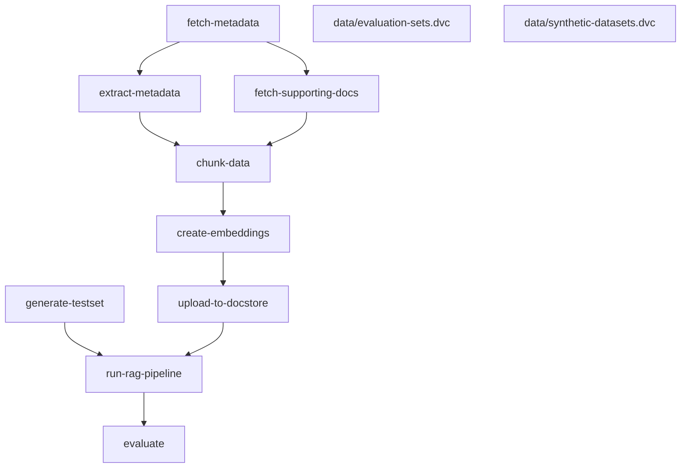

# llm-eval
This repository contains a reproducible workflow setup using [DVC](https://dvc.org/) backed by a [JASMIN object store](https://help.jasmin.ac.uk/docs/short-term-project-storage/using-the-jasmin-object-store/). Before working with the repository please contact [Matt Coole](mailto:matcoo@ceh.ac.uk) to request access to the Jasmin object store `llm-eval-o`. Then follow the instructions below.

## Requirements
- [Ollama](https://ollama.com/download) ([`llama3.1`](https://ollama.com/library/llama3.1) and [`mistral-nemo`](https://ollama.com/library/mistral-nemo) models)

## Getting started
First create a new virtual environment and install the required dependencies:
```shell
python -m venv .venv
source .venv/bin/activate
pip install .
```
Next setup your local DVC configuration with your [Jasmin object store access key](https://help.jasmin.ac.uk/docs/short-term-project-storage/using-the-jasmin-object-store/#creating-an-access-key-and-secret):
```shell
dvc remote modify --local jasmin access_key_id '<ACCES_KEY_ID>'
dvc remote modify --local jasmin secret_access_key '<KEY_SECRET>'
```
Pull the data from the object store using DVC:
```shell
dvc pull
```
You should now be ready to re-run the pipeline:
```shell
dvc repro
```
This pipeline is defined in [`dvc.yaml`](dvc.yaml) and can be viewed with the command:
```shell
dvc dag
```
or it can be output to mermaid format to display in markdown:
```shell
dvc dag -md
```

> Note: To re-run the `fetch-supporting-docs` stage of the pipeline you will need to request access to the [Legilo](https://legilo.eds-infra.ceh.ac.uk/) service from the EDS dev team and provide your `username` and `password` in a `.env` file.

## Running Experiments
The pipeline by default will run using the parameters defind in [`params.yaml`](params.yaml). To experiment with varying these paramaters you can change them directly, or use [DVC experiments](). 

To run an experiment varying a particual parameter:
```shell
dvc exp run -S hp.chunk-size=1000
```
This will re-run the pipeline but override the value of the `hp.chunk-size` parameter in [`params.yaml`](params.yaml) and set it to `1000`. Only the necessary stages of the pipeline should be re-run and the result should appear in your workspace.

You can compare the results of your experiment to the results of the baseline run of the pipeline using:
```shell
dvc exp diff
```
```shell
Path               Metric              HEAD      workspace    Change
data/metrics.json  answer_correctness  0.049482  0.043685     -0.0057974
data/metrics.json  answer_similarity   0.19793   0.17474      -0.02319
data/metrics.json  context_recall      0.125     0            -0.125
data/metrics.json  faithfulness        0.75      0.69375      -0.05625

Path         Param          HEAD    workspace    Change
params.yaml  hp.chunk-size  300     1000         700
```
## Notes

### DVC and CML
Notes on the use of Data Version Control and Continuous Machine Learning:
- [DVC](dvc.md)
- [CML](cml.md)

### vLLM
Notes on running models with vLLM:
- [vLLM](vllm.md)
