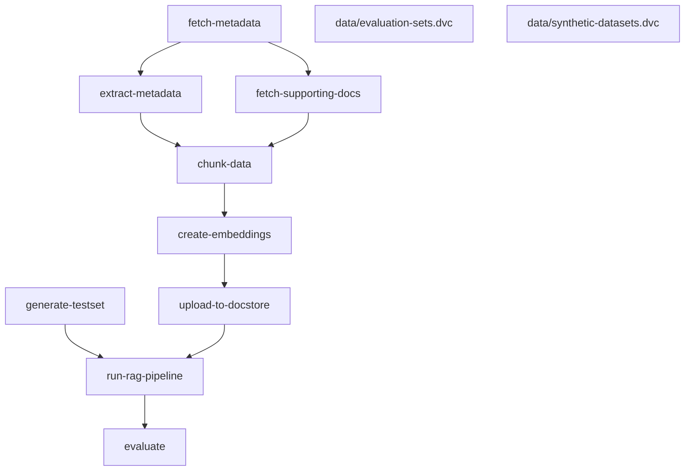

```mermaid
flowchart TD
	node1["chunk-data"]
	node2["create-embeddings"]
	node3["evaluate"]
	node4["extract-metadata"]
	node5["fetch-metadata"]
	node6["fetch-supporting-docs"]
	node7["generate-testset"]
	node8["run-rag-pipeline"]
	node9["upload-to-docstore"]
	node1-->node2
	node2-->node9
	node4-->node1
	node5-->node4
	node5-->node6
	node6-->node1
	node7-->node8
	node8-->node3
	node9-->node8
	node10["data/evaluation-sets.dvc"]
	node11["data/synthetic-datasets.dvc"]
```
