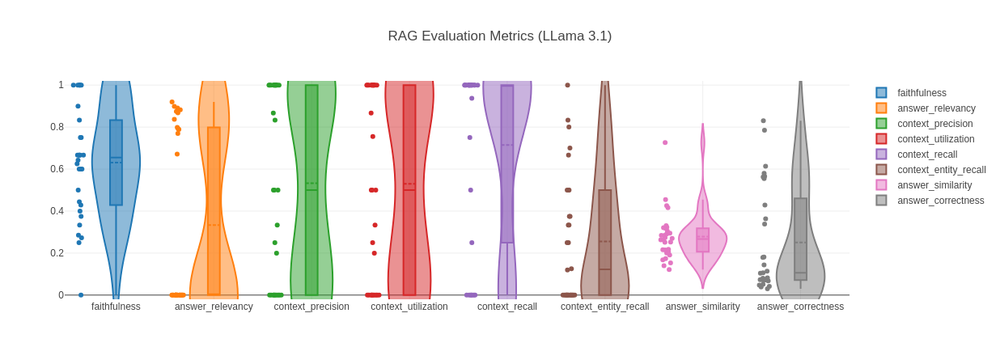

# RAGAS 
[RAGAS](https://docs.ragas.io) is a python library that can be used to evaluate RAG (Retrieval Augmented Generative) pipelines using a variety of metrics. The library can also be used to generate synthetic data sets that can be used in this testing process (see this [example](https://github.com/NERC-CEH/llm-eval/blob/main/data/synthetic-datasets/eidc_rag_test_set.csv) based on the EIDC metadata descriptions). 

## Usage
The library is expected to be used using ChatGPT. If you have a ChatGPT login and access token, follow the instructions in the [documentation](https://docs.ragas.io/en/latest/getstarted/index.html). To run with a local LLM requires a few additional steps beyond what is described.

### Fixing Nested Async Runner
The RAGAS library uses nest a synchronous threads to run which often cause problems in the event loop. To fix this issue, use the `nest_asyncio` library:
```shell
pip install nest-asyncio
```
then in your code before running RAGAS:
```python
import nest_asyncio
nest_asyncio.apply()
```

### Setting `RunConfig`
Additionally running against a local LLM can cause issues with the LLM/serivice being overwhelmed with too many requests. To avoid this create a RunConfig that limits the number of workers so your local LLM can process just one request at a time:
```python
config = RunConfig(max_workers=1)
```
It may also be helpful to set the `max_retries` parameter on this config to move on sooner after failures.

This config can be handed to any RAGAS method that accepts the `run_config` parameter e.g.
```python
TestsetGenerator.from_langchain(llm, llm, embeddings, run_config=RunConfig(max_workers=1, max_retries=1))
```

### Choice of LLM
Whilst testing using various LLMs available on [Ollama](https://ollama.com/), it became apparent some do a better job at returning responses in the specified format (something that is essential for RAGAS to run correctly). During testing one of the better models for ensuring properly formatted response was the `mistral-nemo` model. To use this model with RAGAS:
```python
from langchain_community.embeddings import OllamaEmbeddings
from langchain_community.chat_models import ChatOllama

llm = ChatOllama(model='mistral-nemo')
embeddings = OllamaEmbeddings(model='mistral-nemo'4)
```
It may also be necessary to increase the default context size when using Ollama based models using `num_ctx` e.g.
```python
llm = ChatOllama(model='mistral-nemo'), num_ctx=16384
```
## Notebooks
The ragas_synth.ipynb notebook can be run to generate a synthetic test set similar to that found in `data/`. The ragas_eval.ipynb can be run to generate a set of metrics based upon this synthetic test set and the response retrieved by a RAG pipeline (or any other kind of LLM response):

The various evaluation metrics and how to interpret them are described [here](https://docs.ragas.io/en/latest/concepts/metrics/index.html).